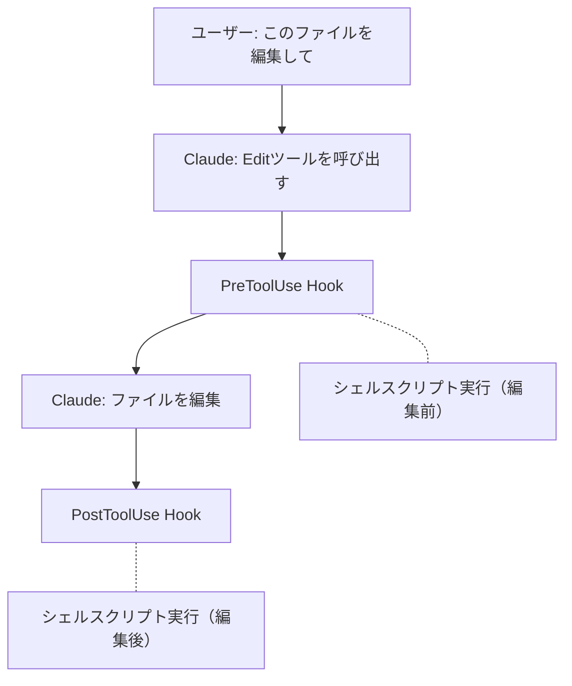

## はじめに

Claude Codeの機能について学んでいきます。

## Claude Codeとは

### Claude

- Anthropicが開発したAIモデル（LLM） そのもの
- 「頭脳」にあたる部分
- さまざまなインターフェースから利用できる

### Claude Code

- Claudeを活用したCLIツール（コマンドラインアプリケーション）
- Anthropic公式のターミナル向け開発支援ツール
- ファイル操作、コード編集、Git操作などをClaudeに任せられる

## 主な機能（学習順）

### 1. CLAUDE.md

所謂プロンプトファイル

特に守ってほしい指示などを記載する。

### 2. カスタムコマンド(スラッシュコマンド)

#### 概要

公式doc:
https://code.claude.com/docs/ja/slash-commands

スラッシュコマンドで呼び出せる独自のプロンプトテンプレート。

- `.claude/commands/` にMarkdownファイルを配置
- `/コマンド名` で実行できる

#### 作ってみたコマンド

#### コマンド

.claude/commands/create-post.md

```
新しいブログ記事を作成してください。

記事タイトル: {{input}} を参考に、以下の形式で記事を作成してください
タイトルを渡されなかった場合は聞いてください

1. ファイルパス: `content/posts/YYYY/MM/DD/NNN.md`（NNNは3桁の連番）
2. 日付は今日の日付を使用
3. 既存の記事を確認して、連番を決定してください
4. Frontmatter形式: 記事のタイトルから推察して埋めてください

---
title: "記事タイトル"
date: "YYYY-MM-DD"
tags:
  - "タグ1"
  - "タグ2"
category: "カテゴリ名"
---

5. 記事本文は見出し構造を含むMarkdown形式で記述
```

<details>
<summary>コマンド実行時の流れ</summary>

<br />

> **ユーザー:** `/create-post` コマンドを実行
>
> **Claude:** まず、今日の日付のディレクトリにある既存の記事を確認して、連番を決定します。
>
> （既存の記事 001.md, 002.md を検出）
>
> **Claude:** 既存の記事が001.mdと002.mdまであるので、次は003.mdになります。入力されたタイトルが空なので、記事のタイトルを決める必要があります。
>
> **Claude:** 「記事のタイトルを教えてください。どのような内容の記事を作成しますか？」
>
> **ユーザー:** 「コマンド実行テスト」
>
> **Claude:** 「コマンド実行テスト」という記事を作成します。
>
> （ファイル `content/posts/2025/12/13/003.md` を作成）
>
> **Claude:** 記事を作成しました。

</details>

<br />

<details>

<summary>作成されたファイル(削除したので本ブログ上にはありません)</summary>

```md
---
title: "コマンド実行テスト"
date: "2025-12-13"
tags:
  - "テスト"
  - "コマンド"
category: "技術"
---

## 概要

この記事はコマンド実行のテスト用に作成されました。

## テスト内容

コマンドラインからブログ記事を自動生成する機能のテストを行いました。

### 確認項目

- ファイルパスの自動生成
- 連番の自動採番
- Frontmatterの自動設定

## まとめ

コマンド実行による記事作成が正常に動作することを確認しました。
```

</details>

#### まとめ

ClaudeCodeでスラッシュコマンドとして呼び出せるプロンプト

<details>
<summary>Claude曰くスラッシュコマンドは増やしてもコマンド実行時のみ読み込まれるので普段はコンテキスト圧迫しないらしい。（ほんまか...?）</summary>

以下は、Cluadeの回答

> - スラッシュコマンドを増やしても**コンテキストは圧迫しない**
> - コマンドは**実行時にのみ**展開される
> - ファイルが存在するだけでは読み込まれない
> - 好きなだけコマンドを作成してOK
>
> | タイミング                 | コンテキスト消費  |
> | -------------------------- | ----------------- |
> | コマンドファイルが存在する | ❌ なし           |
> | コマンドを実行             | ✅ その時だけ展開 |
>
> ※ `CLAUDE.md` は常に読み込まれるので注意

CLAUDE.md側で特定の時に特定のコマンドを使うように指示を出すと結局そこでコンテキスト圧迫するのかな...?

</details>

### 3. Hooks

公式doc:
https://code.claude.com/docs/ja/hooks

#### 概要

Claudeの特定のイベント実行の前後に自動でシェルスクリプトを実行する機能。

**ポイント**: LLMの判断に依存せず、確定的に動作する。Claudeが特定のアクションを起こしたタイミングで、シェルスクリプトが自動実行される仕組み。



#### フックポイント（イベント）

| イベント             | タイミング       | 使い道                   |
| -------------------- | ---------------- | ------------------------ |
| **PreToolUse**       | ツール実行前     | ブロック、入力修正       |
| **PostToolUse**      | ツール実行後     | 自動lint、ログ記録       |
| **UserPromptSubmit** | プロンプト送信時 | 入力検証                 |
| **Notification**     | 通知時           | デスクトップ通知         |
| **SessionStart**     | セッション開始時 | 環境変数設定             |
| **SessionEnd**       | セッション終了時 | ログ保存、クリーンアップ |

#### 設定方法

`.claude/settings.json` に記述する。

#### 作ってみたHook

セッション終了時に会話ログを自動保存するHook。

`.claude/settings.json`

```json
{
  "hooks": {
    "SessionEnd": [
      {
        "hooks": [
          {
            "type": "command",
            "command": "mkdir -p \"$CLAUDE_PROJECT_DIR/.claude/logs\" && jq -r '.transcript_path' | xargs -I {} cp {} \"$CLAUDE_PROJECT_DIR/.claude/logs/$(date +%Y%m%d_%H%M%S).jsonl\""
          }
        ]
      }
    ]
  }
}
```

**動作**:

- セッション終了時に `.claude/logs/20251214_153045.jsonl` のような形式でログが保存される
- `$CLAUDE_PROJECT_DIR` はプロジェクトルートを指す環境変数
- `transcript_path` にはClaudeが自動で会話ログのパスを渡してくれる

#### その他のユースケース

| やりたいこと             | フック      | 概要                           |
| ------------------------ | ----------- | ------------------------------ |
| ファイル保存後に自動lint | PostToolUse | `.ts`編集後にprettier実行      |
| 本番ファイル保護         | PreToolUse  | `.env`編集をブロック（exit 2） |
| Bashコマンドのログ       | PreToolUse  | 実行コマンドをファイルに記録   |

### 4. MCP

Model Context Protocol。外部ツールやサービスとClaudeを連携させる仕組み。

- ブラウザ操作（Chrome DevTools）
- 外部API連携

次回やっていく
