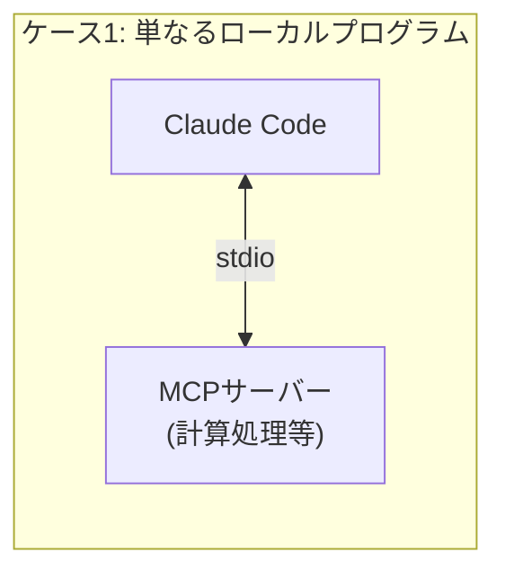
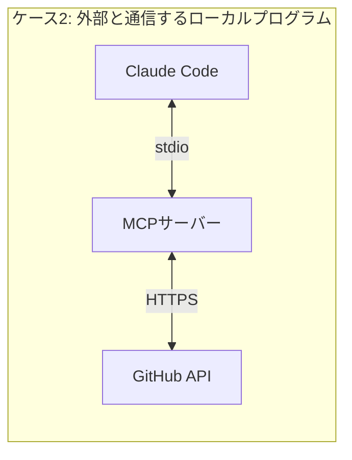
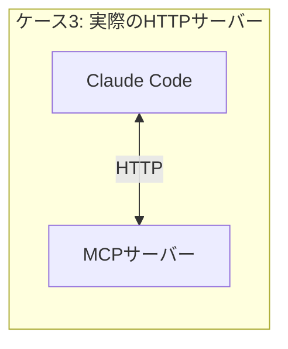
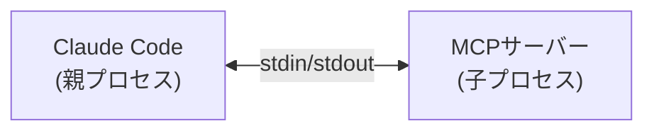
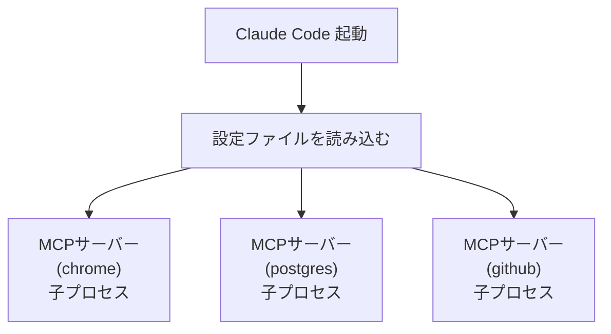
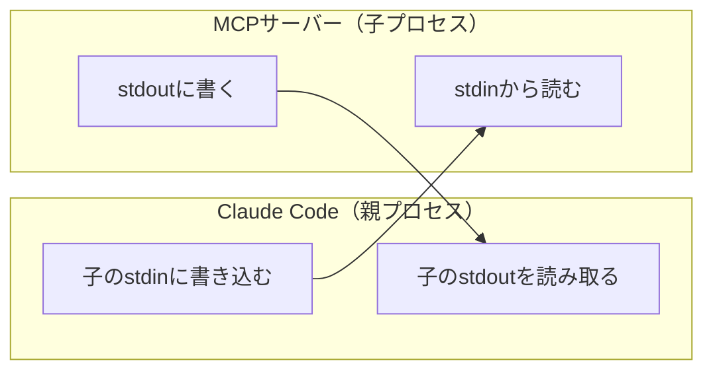
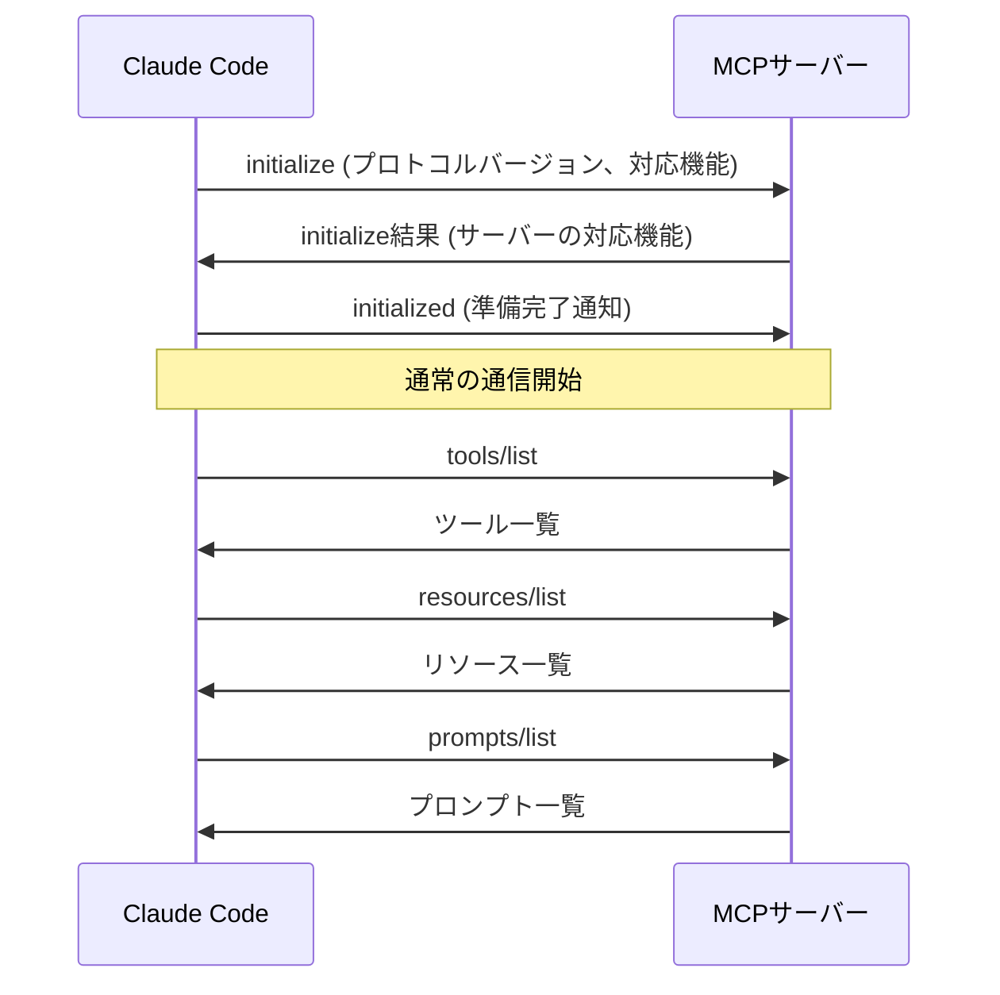
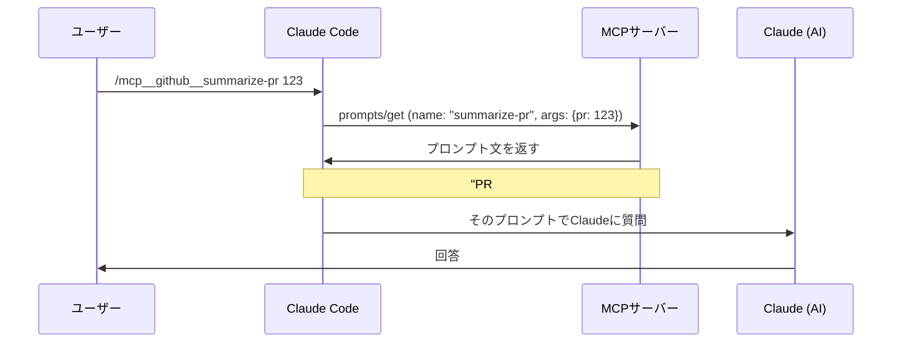

## はじめに

前回に引き続き、Claude Codeの機能について学んでいきます。今回はMCP（Model Context Protocol）について深掘りします。

## MCPとは

公式doc:
https://code.claude.com/docs/ja/mcp

### 概要

MCP（Model Context Protocol）は、Anthropicが2024年11月に公開した**AIと外部システムをつなぐ標準規格**。

これまでの課題:

- Claudeは賢いが、外部データに直接アクセスできない
- DBやAPI、ブラウザなどに接続するには個別に実装が必要だった

MCPが解決:

- **統一されたプロトコル**で様々なツール・データソースに接続
- 一度MCPサーバーを作れば、どのMCPクライアントからも利用可能

### なぜ「サーバー」と呼ばれるのか

クライアント-サーバーモデルの考え方に基づいている。

| 役割                | 説明                         | 例                          |
| ------------------- | ---------------------------- | --------------------------- |
| **MCPサーバー**     | データ・機能を**提供する側** | Chrome DevTools、PostgreSQL |
| **MCPクライアント** | データ・機能を**利用する側** | Claude Code、Claude Desktop |

ただし、一般的なWebサーバーとは違い、**ローカルで動く中継プログラム**という実態。

### 「MCPサーバー」の実態はさまざま

「サーバー」という名前は**役割（提供する側）**を表しているだけで、技術的にHTTPサーバーかどうかとは別の話。

| ケース               | 実態                               |
| -------------------- | ---------------------------------- |
| stdio + 外部連携なし | ただのローカルプログラム           |
| stdio + 外部連携あり | ローカルプログラムが外部APIを叩く  |
| HTTP                 | 実際にHTTPサーバーとして動いている |







## MCPの仕組み

### 通信プロトコル: JSON-RPC 2.0

MCPはJSON-RPC 2.0でメッセージをやり取りする。

**JSON-RPCとは**: JSONでメソッド（関数）を呼び出す規格。

リクエスト例:

```json
{
  "jsonrpc": "2.0",
  "method": "take_snapshot",
  "params": { "verbose": false },
  "id": 1
}
```

レスポンス例:

```json
{
  "jsonrpc": "2.0",
  "result": { "snapshot": "..." },
  "id": 1
}
```

RESTのようにHTTPメソッド（GET/POST/PUT/DELETE）を使い分ける必要がなく、**メソッド名を指定するだけ**というシンプルさが特徴。

### トランスポート（通信経路）

公式doc:
https://modelcontextprotocol.io/specification/2025-06-18/basic/transports

JSON-RPCをどうやって送受信するか。主に2種類ある。

#### 1. stdio（標準入出力）← ローカル向け



- Claude CodeがMCPサーバーを**子プロセスとして起動**
- **stdin**（標準入力）でリクエストを送信
- **stdout**（標準出力）でレスポンスを受信

**Claude Codeではこれが主流。**

#### 2. Streamable HTTP ← リモート向け

- ネットワーク越しにMCPサーバーに接続
- 本番環境・複数ユーザーで共有する場合向け

#### stdio とは

Standard I/O（標準入出力）の略。3つをまとめた呼び方。

| 名前           | 略称   | 役割                 |
| -------------- | ------ | -------------------- |
| 標準入力       | stdin  | プログラムへの入力   |
| 標準出力       | stdout | プログラムからの出力 |
| 標準エラー出力 | stderr | エラーメッセージ     |

### トランスポートの指定方法

設定ファイルの書き方で決まる。

stdio（ローカル）の場合:

```json
{
  "mcpServers": {
    "chrome-devtools": {
      "command": "npx",
      "args": ["@anthropic-ai/mcp-chrome-devtools@latest"]
    }
  }
}
```

HTTP（リモート）の場合:

```json
{
  "mcpServers": {
    "remote-server": {
      "url": "https://example.com/mcp"
    }
  }
}
```

| 設定キー         | トランスポート |
| ---------------- | -------------- |
| `command` がある | stdio          |
| `url` がある     | HTTP           |

※ローカルでもHTTP通信は可能だが、個人の開発環境ではstdioで十分。

## MCPサーバーと接続するとは

Claude CodeがMCPサーバーと通信可能な状態になること。

トランスポートによって接続方法が異なる。

| トランスポート | 接続方法                          |
| -------------- | --------------------------------- |
| **stdio**      | MCPサーバーを子プロセスとして起動 |
| **HTTP**       | 既存のMCPサーバーにHTTPで接続     |

`/mcp` コマンドで接続状態の確認・再接続ができる。

### stdioの場合の流れ



`ps aux | grep mcp` で実際にプロセスが起動していることを確認できる。

### stdioの通信の仕組み

親プロセス（Claude Code）が子プロセス（MCPサーバー）のstdin/stdoutを操作する。



1. Claude Codeが子プロセスのstdinにJSON-RPCリクエストを**書き込む**
2. MCPサーバーが自分のstdinから**読み取る**
3. MCPサーバーが処理結果を自分のstdoutに**書き込む**
4. Claude Codeが子プロセスのstdoutから**読み取る**

## MCPサーバーのツール確認方法

### Claude Code内で `/mcp` コマンド

1. `/mcp` を実行
2. MCPサーバーのリストが表示される
3. サーバーを選択してEnter
4. 「View tools」を選択してEnter
5. ツールの一覧と詳細が表示される

### ターミナルで確認

```bash
claude mcp get <サーバー名>
```

### なぜツール一覧が取得できるのか

MCPには明確なプロトコル仕様があり、ツール一覧を取得するための `tools/list` メソッドが定義されている。

公式仕様:
https://modelcontextprotocol.io/specification/2025-06-18

<details>
<summary>なぜClaude CodeがMCPサーバーでできることが分かるのか</summary>

### ライフサイクル



- **プロトコル仕様上**: `tools/list`、`resources/list`、`prompts/list` はオンデマンド（いつ呼んでもいい）
- **Claude Codeの実装**: 起動時に自動で取得していると思われる（`/mcp` で即座に一覧表示できるため）

### 初期化時のやり取り（例）

クライアント → サーバー:

```json
{
  "method": "initialize",
  "params": {
    "protocolVersion": "2024-11-05",
    "capabilities": {
      "tools": true,
      "resources": true
    }
  }
}
```

サーバー → クライアント:

```json
{
  "result": {
    "protocolVersion": "2024-11-05",
    "capabilities": {
      "tools": { "listChanged": true },
      "resources": { "listChanged": true }
    }
  }
}
```

### MCPサーバーが提供できる機能

| 機能          | 説明                                    |
| ------------- | --------------------------------------- |
| **Tools**     | AIが実行できるアクション（関数）        |
| **Resources** | MCPサーバー自体のコンテキスト（データ） |
| **Prompts**   | 再利用可能なプロンプトテンプレート      |

<details>
<summary>Promptsの詳細</summary>

MCPサーバーが**「Claudeにこう聞いて」というプロンプト文**を返す仕組み。

Tools/Resourcesとの違い:

| 機能          | 使い方                                     |
| ------------- | ------------------------------------------ |
| **Tools**     | AIが自動で「使おう」と判断して呼ぶ         |
| **Resources** | AIが自動で「この情報が必要」と判断して取得 |
| **Prompts**   | ユーザーが明示的に選んで使う               |

### Promptsの確認方法

1. `/` を入力 → 利用可能なコマンド一覧が表示される
2. `/mcp` → サーバーを選択 → 「View prompts」で一覧表示

### 流れ



「よく使う質問パターン」をMCPサーバー側で管理できる。

</details>

</details>

## MCPサーバーの設定方法

公式doc:
https://code.claude.com/docs/ja/mcp

### 方法: 設定ファイルに直接記述

`.mcp.json`（プロジェクトルート）に記述:

```json
{
  "mcpServers": {
    "filesystem": {
      "command": "npx",
      "args": ["-y", "@modelcontextprotocol/server-filesystem", "/Users/yourname"]
    }
  }
}
```

### 設定の構造

```json
{
  "mcpServers": {
    "filesystem": {
      // MCPサーバー名（任意の識別子）
      "command": "npx", // 起動コマンド
      "args": ["-y", "@modelcontextprotocol/server-filesystem", "/Users/yourname"]
      // コマンドに渡す引数（MCPサーバーごとに異なる）
    }
  }
}
```

argsの内容は**各MCPサーバーのREADMEやドキュメントを参照**する必要がある。

### スコープ（設定の適用範囲）

| スコープ    | 説明                           | 設定場所                  |
| ----------- | ------------------------------ | ------------------------- |
| **local**   | 自分だけ、このプロジェクトのみ | `.claude/settings.json`   |
| **project** | プロジェクト全員で共有         | `.mcp.json`               |
| **user**    | 自分の全プロジェクト           | `~/.claude/settings.json` |

### 管理コマンド

```bash
claude mcp list          # 一覧表示
claude mcp get {名前}    # 詳細表示
```

Claude Code内では `/mcp` で接続状態を確認・再接続ができる。
