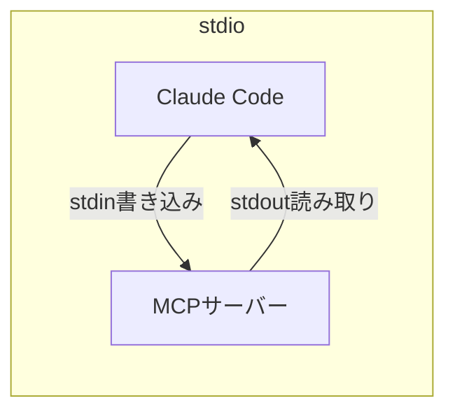
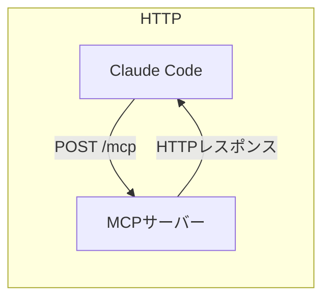
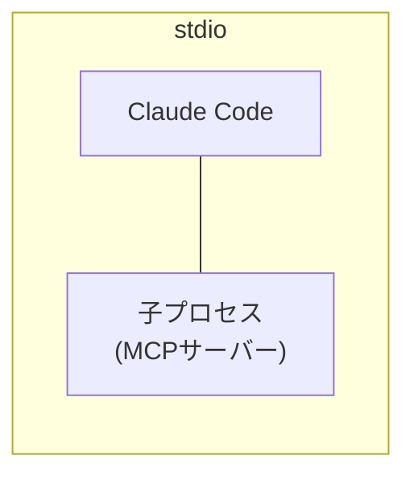
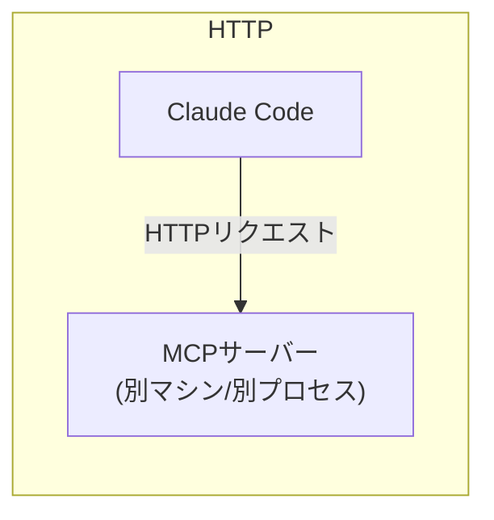
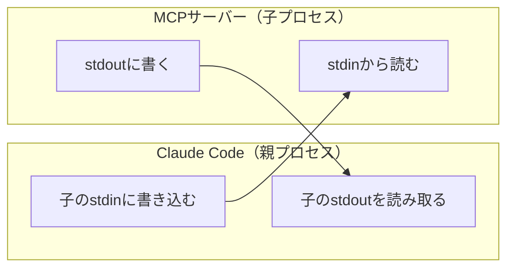
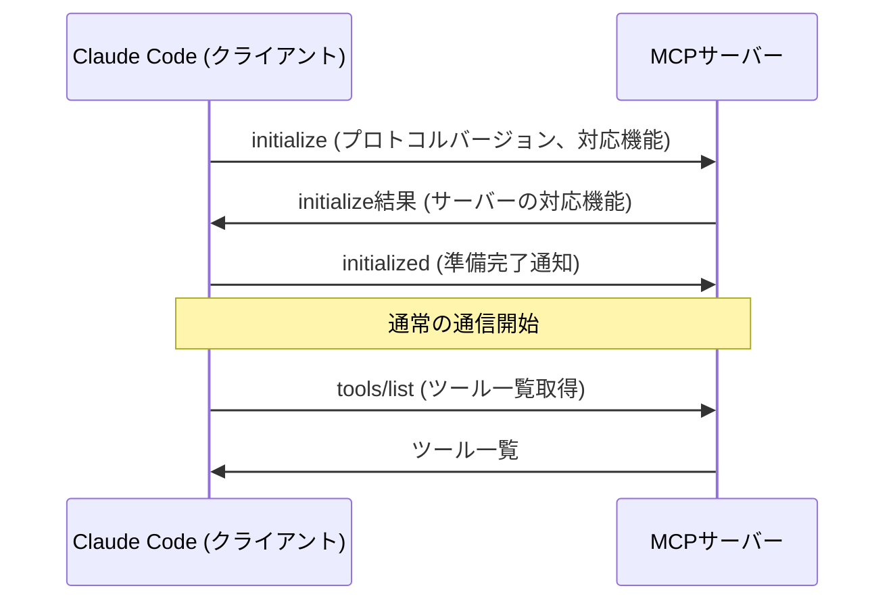
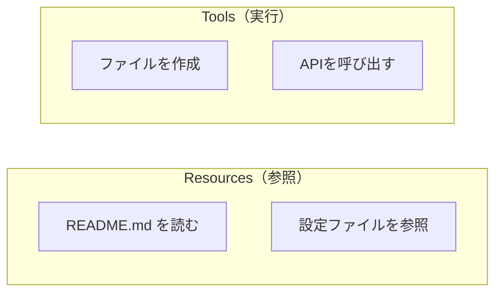
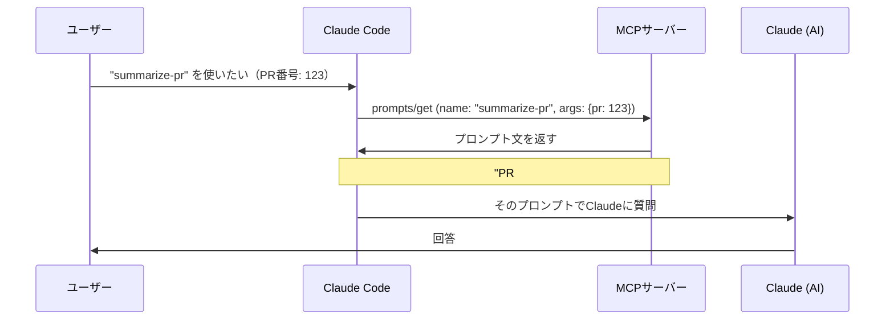
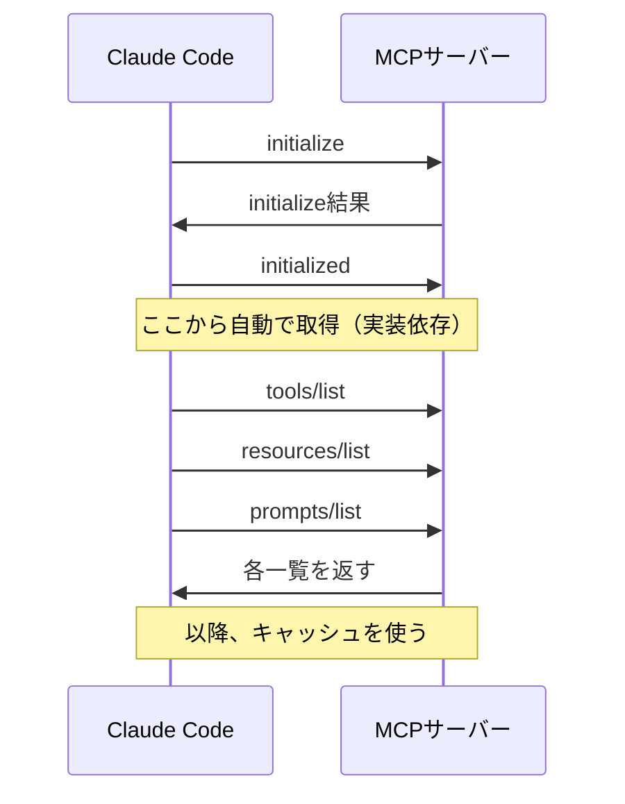

# AI会話ログ

> **User:** MCPはどんな役割でどんな仕組みで動くのですか？

---

公式ドキュメントを確認してみます。

---

MCPの役割と仕組みを整理します。

## MCPの役割

**AIと外部システムをつなぐ標準規格**です。

これまでの課題:

- Claudeは賢いが、外部データにアクセスできない
- DBやAPI、ブラウザなどに接続するには個別に実装が必要だった
- 各データソースごとにカスタム実装 → 拡張性がない

MCPが解決:

- **統一されたプロトコル**で様々なツール・データソースに接続
- 一度MCPサーバーを作れば、どのMCPクライアントからも利用可能

## MCPの仕組み

```
┌─────────────┐     ┌─────────────┐     ┌─────────────┐
│ MCPクライアント │ ←→ │ MCPサーバー   │ ←→ │ 外部システム  │
│ (Claude Code) │     │             │     │ (DB, API等) │
└─────────────┘     └─────────────┘     └─────────────┘
        ↑                   ↑
        └── JSON-RPC通信 ──┘
```

- **MCPクライアント**: Claude Code、Claude Desktop、VSCodeなど
- **MCPサーバー**: 各ツール用の中継サーバー（Chrome DevTools、PostgreSQL等）
- **通信**: JSON-RPC形式で標準化

Sources:

- [Claude Code を MCP 経由でツールに接続する - Claude Docs](https://docs.claude.com/ja/docs/claude-code/mcp)
- [Anthropic、Model Context Protocolを発表 - Zenn](https://zenn.dev/shirochan/articles/37e5aea29c4e46)
- [Introducing the Model Context Protocol - Anthropic](https://www.anthropic.com/news/model-context-protocol)

---

> **User:** MCPは基本的にMCPサーバーという名称で言われることが多いですが、サーバーなのですか？

---

良い質問ですね。調べてみます。

---

なるほど、**クライアント-サーバーモデル**の考え方です。

## なぜ「サーバー」なのか

| 役割                | 説明                         | 例                          |
| ------------------- | ---------------------------- | --------------------------- |
| **MCPサーバー**     | データ・機能を**提供する側** | Chrome DevTools、PostgreSQL |
| **MCPクライアント** | データ・機能を**利用する側** | Claude Code、Claude Desktop |

つまり：

- Claude Code が「このページのスナップショットちょうだい」とリクエスト
- Chrome DevTools MCPサーバーが「はい、どうぞ」とレスポンス

この関係性から「サーバー」と呼ばれています。

## 一般的なWebサーバーとの違い

ただし、インターネット上で常時稼働するWebサーバーとは違い：

- **ローカルで起動するプロセス**
- Claude Code起動時に一緒に立ち上がる
- JSON-RPCで通信

「サーバー」という名前ですが、実態は**ローカルで動く中継プログラム**ですね。

---

> **User:** JSON-RPC通信ってどんな規格でしたっけ

---

## JSON-RPCとは

**JSONでメソッド（関数）を呼び出す規格**です。

### 基本の仕組み

```
クライアント → 「このメソッド実行して」 → サーバー
クライアント ← 「結果はこれ」         ← サーバー
```

### リクエスト例

```json
{
  "jsonrpc": "2.0",
  "method": "take_snapshot",
  "params": { "verbose": false },
  "id": 1
}
```

### レスポンス例

```json
{
  "jsonrpc": "2.0",
  "result": { "snapshot": "..." },
  "id": 1
}
```

### 特徴

| 特徴                 | 説明                                    |
| -------------------- | --------------------------------------- |
| シンプル             | メソッド名 + パラメータ を送るだけ      |
| 軽量                 | JSONなので扱いやすい                    |
| トランスポート非依存 | HTTP、WebSocket、標準入出力など何でもOK |

RESTのようにHTTPメソッド（GET/POST/PUT/DELETE）を使い分ける必要がなく、**全部POSTでメソッド名を指定するだけ**というシンプルさが特徴です。

MCPがJSON-RPCを採用しているのは、この軽量さとシンプルさが理由ですね。

Sources:

- [JSON-RPC 2.0 Specification](https://www.jsonrpc.org/specification)
- [JSON-RPC サクッと入門 - Zenn](https://zenn.dev/hachimada/articles/jsonrpc-basic)
- [JSON-RPCって何？ - Qiita](https://qiita.com/oohira/items/35e6eaaf4b44613ad7d3)

---

> **User:** MCPサーバーとはどのように通信するの？

---

## MCPの通信方法（トランスポート）

MCPは**JSON-RPC 2.0**でメッセージをやり取りしますが、その通信経路には主に2種類あります。

### 1. stdio（標準入出力）← ローカル向け

```
┌─────────────┐      stdin/stdout      ┌─────────────┐
│ Claude Code │ ←───────────────────→ │ MCPサーバー  │
│  (親プロセス) │                       │ (子プロセス)  │
└─────────────┘                        └─────────────┘
```

- Claude CodeがMCPサーバーを**子プロセスとして起動**
- **stdin**（標準入力）でリクエストを送信
- **stdout**（標準出力）でレスポンスを受信
- ローカル実行専用

**Claude Codeで使う場合はこれが主流**です。

### 2. HTTP（Streamable HTTP / SSE）← リモート向け

```
┌─────────────┐       HTTP POST        ┌─────────────┐
│   クライアント │ ←───────────────────→ │ MCPサーバー  │
│             │         SSE            │  (リモート)   │
└─────────────┘                        └─────────────┘
```

- ネットワーク越しにMCPサーバーに接続
- 本番環境・複数ユーザー向け

### Claude Codeの場合

設定ファイルを見ると分かりやすいです：

```json
{
  "mcpServers": {
    "chrome-devtools": {
      "command": "npx",  ← コマンドを実行
      "args": ["@anthropic-ai/mcp-chrome-devtools@latest"]
    }
  }
}
```

`command` でプロセスを起動 → **stdioで通信**という流れですね。

Sources:

- [Transports - Model Context Protocol](https://modelcontextprotocol.io/docs/concepts/transports)
- [MCP Server Transports: STDIO, Streamable HTTP & SSE](https://godspeed.systems/docs/saarthi/features/mcp/server-transports)

---

> **User:** MCPサーバー自体はローカルで起動するのが主流。リモート上のMCPサーバーにも接続できる機能自体はあるというニュアンス？

---

そうです、その理解で合っています。

## 整理すると

| 方式                  | 用途           | 主な使用場面                         |
| --------------------- | -------------- | ------------------------------------ |
| **ローカル（stdio）** | 個人の開発環境 | Claude Code、Claude Desktop          |
| **リモート（HTTP）**  | 本番・共有環境 | 複数ユーザーで1つのMCPサーバーを共有 |

## 現状

- **ローカルが主流**: Claude Codeの設定例もほぼ全て `command` でローカル起動
- **リモートは「できる」**: プロトコル仕様としてHTTP対応はあるが、まだ発展途上
- MCPサーバー自体がローカルで動いて、その先の外部サービス（GitHub API、DBなど）にアクセスする構成が一般的

```
┌────────────┐     stdio     ┌────────────┐     HTTPS    ┌────────────┐
│Claude Code │ ←──────────→ │MCPサーバー   │ ←─────────→ │ GitHub API │
│  (ローカル)  │              │  (ローカル)   │             │  (リモート)  │
└────────────┘              └────────────┘             └────────────┘
```

MCPサーバー自体はローカル、でもそのサーバーが外部と通信する、という構成ですね。

---

> **User:** stdioってなんでしたっけ？標準入力を全てstdioというんでしたっけ？

---

## stdio とは

**Standard I/O（標準入出力）** の略です。3つをまとめた呼び方ですね。

| 名前               | 略称   | 役割                 | 例                                 |
| ------------------ | ------ | -------------------- | ---------------------------------- |
| **標準入力**       | stdin  | プログラムへの入力   | キーボード入力、パイプ経由のデータ |
| **標準出力**       | stdout | プログラムからの出力 | `echo "hello"` の結果              |
| **標準エラー出力** | stderr | エラーメッセージ     | エラーログ                         |

```
         stdin
           ↓
    ┌─────────────┐
    │  プログラム   │
    └─────────────┘
        ↓      ↓
     stdout  stderr
```

## よく見る例

```bash
# パイプ: 前のstdoutを次のstdinに渡す
cat file.txt | grep "hello"

# リダイレクト: stdoutをファイルに書き込む
echo "hello" > output.txt
```

## MCPの場合

Claude CodeがMCPサーバー（子プロセス）と通信するとき：

- **stdin** にJSON-RPCリクエストを書き込む
- **stdout** からJSON-RPCレスポンスを読み取る

プロセス間通信の最もシンプルな方法ですね。

---

> **User:** つまりローカルで標準入力を実行している。パスは設定ファイルに入っている。ということですか？

---

少し補足すると：

## 設定ファイルに入っているのは「コマンド」

```json
{
  "mcpServers": {
    "chrome-devtools": {
      "command": "npx",                                    ← 実行するコマンド
      "args": ["@anthropic-ai/mcp-chrome-devtools@latest"] ← 引数
    }
  }
}
```

パスというより**起動コマンド**ですね。

## 流れ

```
1. Claude Code起動
      ↓
2. 設定ファイルを読む
      ↓
3. npx @anthropic-ai/mcp-chrome-devtools@latest を実行
   （MCPサーバーが子プロセスとして起動）
      ↓
4. 起動したプロセスの stdin/stdout で通信
```

## つまり

- 設定ファイル → **何を起動するか**（コマンド）
- stdio → **どうやって通信するか**（起動したプロセスとの入出力）

「標準入力を実行」というより、**コマンドでプロセスを起動して、そのプロセスと標準入出力で会話する**というイメージです。

---

> **User:** Claudeと会話しているのとは別プロセスを設定ファイルのMCPサーバー分起動しておくのがCluadeで言うMCPのコネクトに当たりますか？

---

その理解で合っています。

## イメージ

```
┌─────────────────────────────────────────────────────┐
│                   Claude Code 起動                   │
└─────────────────────────────────────────────────────┘
                         ↓
            設定ファイルを読み込む
                         ↓
         ┌───────────────┼───────────────┐
         ↓               ↓               ↓
   ┌──────────┐   ┌──────────┐   ┌──────────┐
   │ MCPサーバー │   │ MCPサーバー │   │ MCPサーバー │
   │  (chrome)  │   │ (postgres) │   │  (github)  │
   │  子プロセス  │   │  子プロセス  │   │  子プロセス  │
   └──────────┘   └──────────┘   └──────────┘
```

## 「MCPに接続」とは

1. 設定ファイルに書かれた**MCPサーバーをそれぞれ子プロセスとして起動**
2. 各プロセスと**stdio経由で通信可能な状態にする**

これが「MCPコネクト」ですね。

## 確認方法

Claude Code起動中に別ターミナルで `ps` コマンドを打つと、MCPサーバーのプロセスが見えるはずです。

```bash
ps aux | grep mcp
```

試してみますか？

---

> **User:** 確かにchrome-mcpなどが起動していました。

---

確認できましたね。

これでMCPの仕組みが実感できたと思います。

## ここまでのまとめ

| 概念        | 実態                                                  |
| ----------- | ----------------------------------------------------- |
| MCPサーバー | ローカルで動く子プロセス                              |
| MCPコネクト | 設定ファイルのサーバーを起動してstdioで通信可能にする |
| 通信方式    | JSON-RPC 2.0をstdio経由でやり取り                     |

```
Claude Code (親プロセス)
    ├── chrome-mcp (子プロセス) ← stdio通信
    ├── postgres-mcp (子プロセス) ← stdio通信
    └── ...
```

---

> **User:** stdioでやりとりするのかStreamable HTTPでやりとりするのかはどこに定義されているのですか？

---

**設定ファイルの書き方で決まります。**

## Claude Codeの場合

### stdio（ローカル）の場合

```json
{
  "mcpServers": {
    "chrome-devtools": {
      "command": "npx",  ← commandがある → stdio
      "args": ["@anthropic-ai/mcp-chrome-devtools@latest"]
    }
  }
}
```

### HTTP（リモート）の場合

```json
{
  "mcpServers": {
    "remote-server": {
      "url": "https://example.com/mcp"  ← urlがある → HTTP
    }
  }
}
```

## 判定ロジック

| 設定キー         | トランスポート |
| ---------------- | -------------- |
| `command` がある | stdio          |
| `url` がある     | HTTP           |

明示的に `"transport": "stdio"` と書くこともできますが、`command` か `url` かで暗黙的に決まる実装が多いですね。

このプロジェクトの設定ファイルも確認してみましょうか？

---

> **User:** つまりlocalのmcpサーバーでもHTTPでの通信も可能ということですよね？

---

その通りです。

## ローカルでもHTTP通信は可能

```
パターンA: stdio（主流）
┌────────────┐    stdio     ┌────────────┐
│Claude Code │ ←─────────→ │MCPサーバー   │
└────────────┘              └────────────┘
      同一マシン内、子プロセスとして起動

パターンB: HTTP（ローカル）
┌────────────┐    HTTP      ┌────────────┐
│Claude Code │ ←─────────→ │MCPサーバー   │
└────────────┘  localhost   └────────────┘
      同一マシン内、別プロセスとして起動
```

## 使い分け

| 方式             | メリット                     | デメリット             |
| ---------------- | ---------------------------- | ---------------------- |
| stdio            | シンプル、設定が楽           | Claude Codeと1対1      |
| HTTP (localhost) | 複数クライアントから接続可能 | 別途サーバー起動が必要 |

## 例えば

ローカルでHTTP使うケース：

- MCPサーバーを**常時起動**しておきたい
- **複数のClaude Codeセッション**から同じMCPサーバーを使いたい

ただ、個人の開発環境では**stdioで十分**なので、HTTPはリモートやチーム共有向けという位置づけですね。

---

> **User:** MCPコネクトとは一般用語？

---

良い指摘です。調べてみます。

---

検索結果が出ませんでした。

**「MCPコネクト」は一般用語ではありません。** 会話の中で私が便宜上使った表現です。

公式ドキュメントでは単に：

- 「MCPサーバーを設定する」
- 「MCPサーバーに接続する」

といった表現が使われています。

---

> **User:** mcpと接続するとは　と言う表現はどうですか？

---

良いですね。実際に `/mcp` コマンドでも「Reconnected to chrome-devtools」と表示されていますし、**「接続」という表現は自然**です。

---

> **User:** httpでの接続の場合も子プロセスを起動するのですか？

---

いい質問です。

**HTTPの場合は子プロセスを起動しません。**

## 違い

| トランスポート | 動作                                           |
| -------------- | ---------------------------------------------- |
| **stdio**      | Claude Codeが`command`でプロセスを**起動する** |
| **HTTP**       | 既に動いているサーバーに**接続するだけ**       |

## 設定の違いを見ると分かりやすい

```json
// stdio: 起動コマンドを指定
{
  "command": "npx",  ← これを実行してプロセスを起動
  "args": ["..."]
}

// HTTP: URLを指定
{
  "url": "https://example.com/mcp"  ← 既存のサーバーに接続
}
```

## つまり

- **stdio**: Claude Codeが親、MCPサーバーが子（ライフサイクルを管理）
- **HTTP**: MCPサーバーは独立して動いている（別途起動が必要）

HTTPの場合、MCPサーバーは事前に誰かが起動しておく必要がありますね。

---

> **User:** サーバー自体ではなく実際に使うときの話です。

---

あ、なるほど。**通信方法**の話ですね。

## 実際に使うとき（ツール呼び出し時）

| トランスポート | 通信方法                           |
| -------------- | ---------------------------------- |
| **stdio**      | 子プロセスのstdin/stdoutに読み書き |
| **HTTP**       | HTTP POSTリクエストを送信          |





どちらも**JSON-RPCメッセージの中身は同じ**ですが、その運び方が違うということですね。

---

> **User:** stdioで疎通する場合は子プロセスを起動したままにするのですよね？

---

その通りです。

## stdio の場合

```
Claude Code起動
    ↓
MCPサーバー起動（子プロセス）← ここで起動
    ↓
ずっと起動したまま ← stdin/stdoutで何度もやり取り
    ↓
Claude Code終了
    ↓
MCPサーバーも終了（子プロセスなので一緒に終了）
```

**毎回起動・終了するわけではない**ですね。

先ほど `ps aux | grep mcp` で確認したとき、Claude Code使用中ずっとプロセスが見えていたのはそのためです。

## 比較

| トランスポート | プロセスのライフサイクル                |
| -------------- | --------------------------------------- |
| **stdio**      | Claude Codeと一緒に起動・終了           |
| **HTTP**       | 独立（Claude Codeと無関係に動き続ける） |

---

> **User:** httpの場合は子プロセスでMCPサーバーとやりとりするの？（MCPサーバー自体のプロセスではない）

---

いい質問です。

**HTTPの場合、子プロセスは起動しません。**

Claude Code自体が直接HTTPリクエストを送信します。

## 比較

| トランスポート | 通信の仕組み                              |
| -------------- | ----------------------------------------- |
| **stdio**      | 子プロセスを起動 → stdin/stdoutで通信     |
| **HTTP**       | 子プロセスなし → 直接HTTPリクエストを送信 |





HTTPクライアント機能はClaude Code自体に内蔵されているので、通信のために別プロセスを起動する必要がないですね。

---

> **User:** 理解しました。MCPサーバーと接続するとはの表現に誤解がある気がするので修正が必要ですね

---

そうですね。現在の説明はstdioの場合だけを想定しています。

修正案：

```markdown
## MCPサーバーと接続するとは

Claude CodeがMCPサーバーと通信可能な状態になること。

トランスポートによって接続方法が異なる。

| トランスポート | 接続方法                          |
| -------------- | --------------------------------- |
| **stdio**      | MCPサーバーを子プロセスとして起動 |
| **HTTP**       | 既存のMCPサーバーにHTTPで接続     |
```

---

> **User:** stdioの場合は子プロセス内で標準入力を行うのですよね？

---

正確に言うと：

**親プロセス（Claude Code）が子プロセス（MCPサーバー）のstdin/stdoutを操作する**形です。



## 流れ

1. Claude Codeが子プロセスのstdinに JSON-RPCリクエストを**書き込む**
2. MCPサーバーが自分のstdinから**読み取る**
3. MCPサーバーが処理結果を自分のstdoutに**書き込む**
4. Claude Codeが子プロセスのstdoutから**読み取る**

「子プロセス内で標準入力を行う」というより、**親が子のstdin/stdoutを経由して会話する**というイメージですね。

---

> **User:** MCPサーバーはサーバーとして呼ばれており、実装としてもサーバーとして起動しているケースもあるがそうではない単純な例えばローカルで起動して外部サーバーなどとやりとりしないJavaアプリということもあり得なくはないということですね

---

その通りです。

## 「MCPサーバー」の実態はさまざま

| ケース               | 実態                               |
| -------------------- | ---------------------------------- |
| stdio + 外部連携なし | ただのローカルプログラム           |
| stdio + 外部連携あり | ローカルプログラムが外部APIを叩く  |
| HTTP                 | 実際にHTTPサーバーとして動いている |

## 例

```
ケース1: 単なるローカルプログラム
┌────────────┐    stdio    ┌────────────┐
│Claude Code │ ←────────→ │MCPサーバー   │  ← HTTPサーバーではない
└────────────┘             │(計算処理等) │     単なるCLIプログラム
                           └────────────┘

ケース2: 外部と通信するローカルプログラム
┌────────────┐    stdio    ┌────────────┐   HTTPS   ┌────────────┐
│Claude Code │ ←────────→ │MCPサーバー   │ ←──────→ │ GitHub API │
└────────────┘             └────────────┘           └────────────┘

ケース3: 実際のHTTPサーバー
┌────────────┐    HTTP     ┌────────────┐
│Claude Code │ ←────────→ │MCPサーバー   │  ← 本当にHTTPサーバーとして動作
└────────────┘             └────────────┘
```

「サーバー」という名前は**役割（提供する側）**を表しているだけで、**技術的にHTTPサーバーかどうかとは別の話**ですね。

---

> **User:** 実際にどんな設定を行えば良いかを教えてください。公式ドキュメントも教えて

---

## MCPサーバーの設定方法

公式doc: https://code.claude.com/docs/ja/mcp

### 方法1: コマンドで追加

```bash
claude mcp add <サーバー名> -- <コマンド>
```

例: Filesystem MCPサーバーを追加

```bash
claude mcp add filesystem -- npx -y @modelcontextprotocol/server-filesystem /Users/yourname
```

### 方法2: 設定ファイルに直接記述

`.mcp.json`（プロジェクトルート）に記述：

```json
{
  "mcpServers": {
    "filesystem": {
      "command": "npx",
      "args": ["-y", "@modelcontextprotocol/server-filesystem", "/Users/yourname"]
    }
  }
}
```

### スコープ（設定の適用範囲）

| スコープ    | 説明                           | 設定場所                  |
| ----------- | ------------------------------ | ------------------------- |
| **local**   | 自分だけ、このプロジェクトのみ | `.claude/settings.json`   |
| **project** | プロジェクト全員で共有         | `.mcp.json`               |
| **user**    | 自分の全プロジェクト           | `~/.claude/settings.json` |

### 管理コマンド

```bash
claude mcp list          # 一覧表示
claude mcp get <名前>    # 詳細表示
claude mcp remove <名前> # 削除
```

Claude Code内では `/mcp` で接続状態を確認。

Sources:

- [Claude Code を MCP 経由でツールに接続する - 公式](https://code.claude.com/docs/ja/mcp)
- [Claude CodeでMCPを快適に使う設定術 - Zenn](https://zenn.dev/kuxu/articles/c832ccf26b7cce)

---

> **User:** この例だとfilesystemがMCP名 commandがMCPサーバーを起動する時のコマンド argsがオプションということですね\
> argsはコマンドによってもちろん変わるという認識ですね

---

その通りです。

## 設定の構造

```json
{
  "mcpServers": {
    "filesystem": {           ← MCPサーバー名（任意の識別子）
      "command": "npx",       ← 起動コマンド
      "args": ["-y", "@modelcontextprotocol/server-filesystem", "/Users/yourname"]
                              ↑ コマンドに渡す引数（MCPサーバーごとに異なる）
    }
  }
}
```

## MCPサーバーごとのargs例

| MCPサーバー     | args                                 | 説明                           |
| --------------- | ------------------------------------ | ------------------------------ |
| filesystem      | `["-y", "パッケージ名", "/path"]`    | アクセスするディレクトリを指定 |
| chrome-devtools | `["パッケージ名"]`                   | 特に引数なし                   |
| postgres        | `["パッケージ名", "postgres://..."]` | DB接続文字列を指定             |

argsの内容は**各MCPサーバーのREADMEやドキュメントを参照**する必要がありますね。

---

> **User:** そのmcpサーバーがどんなコマンドを持っているかはどのように分かるの？

---

## MCPサーバーのツール確認方法

### 1. Claude Code内で `/mcp` コマンド

```
/mcp
```

1. MCPサーバーのリストが表示される
2. サーバーを選択してEnter
3. 「View tools」を選択してEnter
4. **ツールの一覧と詳細が表示される**

### 2. ターミナルで確認

```bash
claude mcp get <サーバー名>
```

### 3. 各MCPサーバーのドキュメント/GitHub

例: Chrome DevTools MCPの場合

- GitHubリポジトリのREADMEにツール一覧が記載されている

---

実際に `/mcp` でchrome-devtoolsのツールを見てみますか？

Sources:

- [Claude Code 上で MCP サーバーの詳細を表示できるようになりました](https://dev.classmethod.jp/articles/claude-code-mcp-server-details/)
- [Claude Code を MCP 経由でツールに接続する - 公式](https://code.claude.com/docs/ja/mcp)

---

> **User:** そのコマンドで入手できるということはMCPを実装する上でのプロトコルがあるのですか？

---

その通りです。**MCPには明確なプロトコル仕様があります。**

## MCPのライフサイクル



## 初期化時のやり取り（例）

クライアント → サーバー:

```json
{
  "method": "initialize",
  "params": {
    "protocolVersion": "2024-11-05",
    "capabilities": {
      "tools": true,
      "resources": true
    }
  }
}
```

サーバー → クライアント:

```json
{
  "result": {
    "protocolVersion": "2024-11-05",
    "capabilities": {
      "tools": { "listChanged": true },
      "resources": { "listChanged": true }
    }
  }
}
```

## MCPサーバーが提供できる機能

| 機能          | 説明                               |
| ------------- | ---------------------------------- |
| **Tools**     | AIが実行できるアクション（関数）   |
| **Resources** | コンテキストとして読み込めるデータ |
| **Prompts**   | 再利用可能なプロンプトテンプレート |

`/mcp` でツール一覧が取得できるのは、**プロトコルで `tools/list` というメソッドが定義されている**からですね。

公式仕様: https://modelcontextprotocol.io/specification/2025-06-18

Sources:

- [MCP Specification](https://modelcontextprotocol.io/specification/2025-06-18)
- [Model Context Protocol GitHub](https://github.com/modelcontextprotocol)

---

> **User:** MCPサーバーが提供できる機能に書いてあるResourcesとはどんなものですか？

---

## Resources と Tools の違い

| 機能          | 説明                       | 例                               |
| ------------- | -------------------------- | -------------------------------- |
| **Tools**     | AIが**実行するアクション** | メール送信、DB更新、ファイル作成 |
| **Resources** | AIが**読み取るデータ**     | ドキュメント、設定ファイル、ログ |

## Resourcesとは

**静的な読み取り専用のデータソース**。URIで識別される。

```
file://./README.md
postgres://db/users
config://settings.json
```

### 具体例

| Resource     | 説明                       |
| ------------ | -------------------------- |
| ドキュメント | README、マニュアル、議事録 |
| 設定ファイル | アプリの設定、環境変数     |
| ログファイル | エラーログ、アクセスログ   |
| DBのスキーマ | テーブル構造の情報         |

### ToolsとResourcesの使い分け



- **Resources**: 「この情報を見て回答して」（コンテキスト提供）
- **Tools**: 「このアクションを実行して」（副作用あり）

RAGのような使い方（社内ドキュメントを参照して回答）はResourcesの活用例ですね。

Sources:

- [MCP (Model Context Protocol) の仕組みを知りたい！ - Qiita](https://qiita.com/megmogmog1965/items/79ec6a47d9c223e8cffc)
- [Model Context Protocol（MCP）とは？ - Zenn](https://zenn.dev/cloud_ace/articles/model-context-protocol)

---

> **User:** そのMCP自体がどんな風に使って欲しいかなどの情報などですか？

---

少し違います。

## Resourcesは「MCPサーバーがアクセスできるデータ」

MCPサーバーの使い方情報ではなく、**そのMCPサーバーが提供するデータそのもの**です。

### 例

| MCPサーバー | Resources（提供するデータ）          |
| ----------- | ------------------------------------ |
| Filesystem  | アクセス可能なファイル・ディレクトリ |
| GitHub      | リポジトリ、Issue、PRの情報          |
| PostgreSQL  | テーブルのスキーマ、データ           |
| Slack       | チャンネル、メッセージ履歴           |

## 「どう使って欲しいか」はPrompts

**Prompts**の方が「使い方のテンプレート」に近いです。

```
例: GitHub MCPサーバーのPrompts
- "このリポジトリのREADMEを要約して"
- "最新のIssueを一覧表示して"
```

## まとめ

| 機能          | 何を提供するか       |
| ------------- | -------------------- |
| **Tools**     | 実行できるアクション |
| **Resources** | 読み取れるデータ     |
| **Prompts**   | 使い方のテンプレート |

Resourcesは「このMCPサーバー経由でこのデータにアクセスできますよ」というカタログのようなものですね。

---

> **User:** Prompts　再利用可能なプロンプトテンプレート　とはなんですか？

---

## MCP Prompts とは

**MCPサーバーが提供する「事前定義されたプロンプトテンプレート」**です。

### 具体例

例えば GitHub MCPサーバーが以下のようなPromptsを提供できる:

| Prompt名        | 説明                 | パラメータ     |
| --------------- | -------------------- | -------------- |
| `summarize-pr`  | PRの内容を要約       | `pr_number`    |
| `review-code`   | コードレビューを依頼 | `file_path`    |
| `explain-issue` | Issueの内容を説明    | `issue_number` |

### 使い方のイメージ

```
ユーザー: "summarize-pr" を実行（PR番号: 123）
    ↓
MCPサーバー: テンプレートにパラメータを埋め込んでプロンプトを生成
    ↓
AI: 生成されたプロンプトで回答
```

### Tools / Resources / Prompts の違い

| 機能          | 誰が制御 | 説明                             |
| ------------- | -------- | -------------------------------- |
| **Tools**     | AI       | AIが判断して実行するアクション   |
| **Resources** | アプリ   | AIに渡すデータ・コンテキスト     |
| **Prompts**   | ユーザー | ユーザーが選んで使うテンプレート |

### メリット

- 「このMCPサーバーでよくやる操作」をテンプレート化
- 毎回プロンプトを書かなくてよい
- チームで共有できる

Sources:

- [MCP Promptsとは？ - WEEL](https://weel.co.jp/media/tech/mcp-prompts/)
- [MCP(The Model Context Protocol) を理解する - Weights & Biases Japan](https://note.com/wandb_jp/n/n1f174aeed14d)

---

> **User:** Claudeで使うのであればClaudeが使うプロンプトをMCPサーバーが返してくるということ？

---

その通りです。

## 流れ



## つまり

MCPサーバーが**「Claudeにこう聞いて」というプロンプト文**を返してくる。

```
MCPサーバーのPrompt定義:
  name: "summarize-pr"
  template: "PR #{{pr_number}}の変更内容を要約してください。
             変更ファイル、目的、影響範囲を含めて説明してください。"
```

↓ ユーザーが `pr_number: 123` で実行

```
MCPサーバーが返すプロンプト:
  "PR #123の変更内容を要約してください。
   変更ファイル、目的、影響範囲を含めて説明してください。"
```

↓ このプロンプトがClaudeに渡される

**「よく使う質問パターン」をMCPサーバー側で管理できる**というイメージですね。

---

> **User:** ToolsとResourcesは、AgentがどのようにそのMCPを使うか判断するためのもの。Promptsは少し違う概念ですね？

---

その通りです。**誰が制御するか**が違います。

## 制御主体の違い

| 機能          | 誰が制御     | 説明                                                 |
| ------------- | ------------ | ---------------------------------------------------- |
| **Tools**     | AI（Agent）  | AIが「この操作が必要」と判断して呼び出す             |
| **Resources** | AI（Agent）  | AIが「この情報が必要」と判断して取得する             |
| **Prompts**   | **ユーザー** | ユーザーが「このテンプレート使いたい」と明示的に選ぶ |

## イメージ

```
Tools / Resources:
  ユーザー: 「PR #123をレビューして」
  AI: （tools/resourcesを見て）「review機能を使おう」と自分で判断

Prompts:
  ユーザー: 「"summarize-pr" テンプレートを使って」と明示的に指定
  AI: 言われた通りにそのテンプレートを使う
```

## つまり

- **Tools / Resources**: Agentの判断材料（自律的に使う）
- **Prompts**: ユーザーが選ぶショートカット（明示的に使う）

この整理で記事の説明を更新しますか？

---

> **User:** ユーザーが定義するのですか？MCPサーバー側で定義されているのではない？

---

すみません、説明が不正確でした。

**定義はすべてMCPサーバー側**です。

## 正確な整理

| 機能          | 定義        | 使用を判断するのは           |
| ------------- | ----------- | ---------------------------- |
| **Tools**     | MCPサーバー | AI（必要に応じて自動で呼ぶ） |
| **Resources** | MCPサーバー | AI（必要に応じて自動で取得） |
| **Prompts**   | MCPサーバー | **ユーザー**（明示的に選ぶ） |

## つまり

- **Tools / Resources**: MCPサーバーが定義 → **AIが自動で判断して使う**
- **Prompts**: MCPサーバーが定義 → **ユーザーが「これ使いたい」と選ぶ**

「誰が制御」は「誰が使うか決めるか」という意味でした。

この整理で記事を更新しますか？

---

> **User:** ユーザーが選ぶというのがよくわかりません。どんなPromptsが定義されているのか調べられるということ？

---

そうです。**MCPサーバーが定義したPromptsの一覧を取得して、ユーザーがUIから選ぶ**という流れです。

## 具体的な使い方（Claude Desktopの場合）

1. MCPサーバーがPromptsを定義している
2. Claude Desktopの「+」メニューにPrompts一覧が表示される
3. ユーザーが使いたいPromptをクリックして選択
4. 引数があれば入力を求められる
5. そのプロンプトでClaudeに質問される

## プロトコル的には

```
Claude Code/Desktop → MCPサーバー: prompts/list（一覧ちょうだい）
MCPサーバー → Claude Code/Desktop: ["summarize-pr", "review-code", ...]

ユーザーが "summarize-pr" を選択

Claude Code/Desktop → MCPサーバー: prompts/get（そのテンプレートちょうだい）
MCPサーバー → Claude Code/Desktop: "PR #{{pr_number}}の変更内容を..."
```

## Tools との違い

| 機能        | 使い方                                   |
| ----------- | ---------------------------------------- |
| **Tools**   | AIが勝手に「使おう」と判断して呼ぶ       |
| **Prompts** | ユーザーがメニューから明示的に選んで使う |

**Toolsは自動、Promptsは手動**というイメージですね。

Sources:

- [Getting Started with MCP Part 2: Prompts and Resources](https://www.danliden.com/posts/20250921-mcp-prompts-resources.html)

---

> **User:** Claude Codeではどのように使うの？

---

## Claude CodeでのPrompts使い方

**スラッシュコマンドとして使える**ようになります。

### 形式

```
/mcp__サーバー名__プロンプト名
```

### 例

```
/mcp__github__summarize-pr 123
```

### 確認方法

1. `/` を入力 → 利用可能なコマンド一覧が表示
2. MCP Promptsは `/mcp__servername__promptname` 形式で表示される

### 流れ

```
ユーザー: /mcp__github__summarize-pr 123
    ↓
Claude Code: MCPサーバーからプロンプトテンプレートを取得
    ↓
Claude: そのプロンプトで回答
```

## まとめ

| クライアント   | Promptsの使い方                           |
| -------------- | ----------------------------------------- |
| Claude Desktop | 「+」メニューから選択                     |
| Claude Code    | `/mcp__サーバー名__プロンプト名` コマンド |

どちらも**ユーザーが明示的に選んで使う**という点は同じですね。

Sources:

- [スラッシュコマンド - Claude Code Docs](https://code.claude.com/docs/ja/slash-commands)
- [Claude CodeのSlash commandsはMCPで配信しよう！](https://dev.classmethod.jp/articles/shuntaka-claude-code-slash-commands-mcp-publish/)

---

> **User:** そのMCPがどんなPromptsを持っているかはClaude Codeではどうやって知るの？

---

先ほどの検索結果と合わせて考えると、2つの方法があります。

## 方法1: `/` を入力して一覧表示

```
/
```

入力すると利用可能なスラッシュコマンド一覧が表示され、MCPのPromptsは `/mcp__サーバー名__プロンプト名` 形式で表示される。

## 方法2: `/mcp` でサーバー詳細を確認

```
/mcp
```

1. MCPサーバー一覧が表示
2. サーバーを選択してEnter
3. 「View prompts」があればPrompts一覧が見られる

---

実際に試してみましょうか？このプロジェクトで接続しているchrome-devtoolsにPromptsがあるか確認できます。

---

> **User:** MCPのプロトコル仕様
> ライフサイクルにPromptsはあるの？

---

はい、**同じタイミングで呼べます**。

## MCPライフサイクル（完全版）

```
1. initialize（初期化・能力交渉）
    ↓
2. initialized（準備完了通知）
    ↓
3. アクティブな通信フェーズ
    ├── tools/list     ← ツール一覧を取得
    ├── resources/list ← リソース一覧を取得
    ├── prompts/list   ← プロンプト一覧を取得
    └── 実際のツール呼び出しなど
```

## ポイント

- **tools/list、resources/list、prompts/list** はすべて同じ「アクティブな通信フェーズ」
- **オンデマンド**（クライアントが必要なときに呼ぶ）
- 初期化時に自動で呼ばれるわけではない

記事のライフサイクル図を更新しますか？現在は `tools/list` だけですが、3つとも追加できます。

---

> **User:** 自動では呼ばれないの？

---

良い質問です。

**プロトコル仕様上は「オンデマンド」**ですが、**実際のクライアント実装では初期化直後に自動で呼ぶことが多い**はずです。

## 理由

- Claude Codeで `/mcp` を実行すると、すぐにTools数が表示される
- 初期化のたびに取得していたら遅い
- UIに一覧を表示するために、接続時に取得しておくのが自然

## つまり

| 観点               | 説明                                       |
| ------------------ | ------------------------------------------ |
| **プロトコル仕様** | 「いつ呼んでもいい」（タイミングは自由）   |
| **実際の実装**     | 初期化直後に自動で呼んでキャッシュしておく |



「呼べる」のではなく「呼んでいる」というのが実態ですね。

---

> **User:** ClaudeCodeではどうなの？

---

詳細な実装は公開されていませんでした。

ただ、分かっていること：

## Claude Codeの動作

| タイミング        | 動作                                            |
| ----------------- | ----------------------------------------------- |
| Claude Code起動時 | 設定ファイルのMCPサーバーを**自動で起動・接続** |
| `/mcp` 実行時     | **即座に**Tools数などが表示される               |

## 推測

```
Claude Code起動
    ↓
MCPサーバー起動・接続（自動）
    ↓
tools/list, resources/list, prompts/list を取得（自動）
    ↓
キャッシュ保持
    ↓
/mcp や / で即座に一覧表示できる
```

起動時に取得していないと `/mcp` で即座に表示できないので、**起動時に自動取得している**と考えるのが自然ですね。

Sources:

- [Claude Code を MCP 経由でツールに接続する - 公式](https://code.claude.com/docs/ja/mcp)
